# Завдання 1. Підготовка репозиторію та локальний запуск

a. http://localhost:8080/api/status:
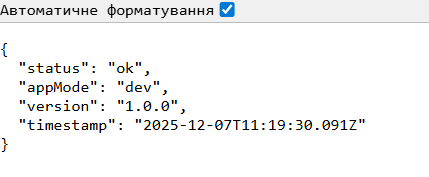

b. http://localhost:8080/api/items?filter=a
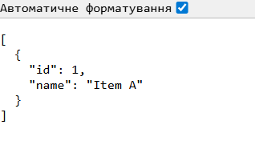

c. http://localhost:8080/api/slow
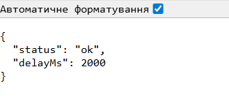

d. http://localhost:8080/api/error
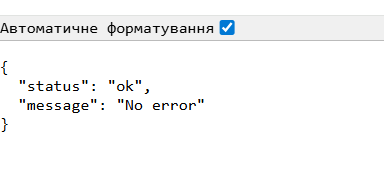

e. http://localhost:8080/healthz
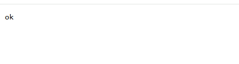

f. http://localhost:8080/ready
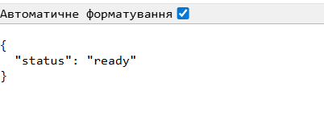

# Завдання 2. Контейнеризація застосунку

docker build -t k8s-demo-app:1.0.0 .
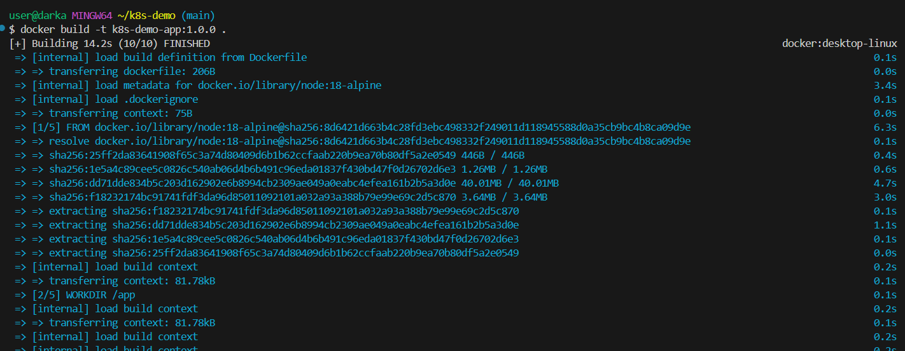

docker run --rm -p 8080:8080 -e SECRET_TOKEN=local k8s-demo-app:1.0.0
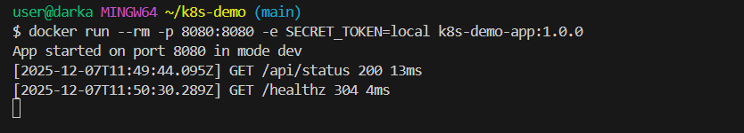
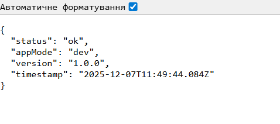
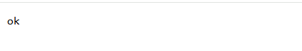

# Завдання 3. Запуск Minikube та перевірка кластера

1. Запустити Minikube:
   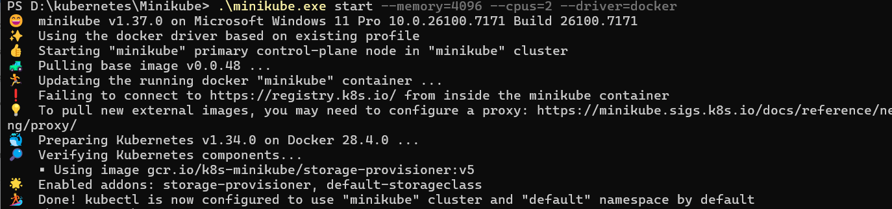

2. Переглянути список профілів (.\minikube profile list)
   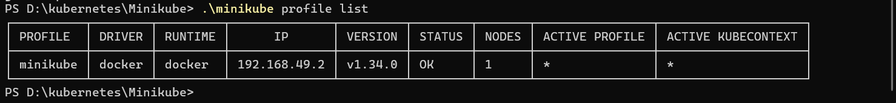

3. Перевірити та налаштувати контекст kubectl:
   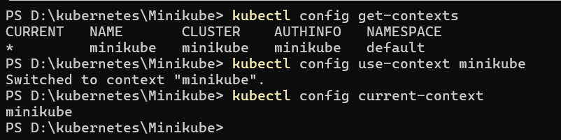

4. Перевірити стан кластера:
   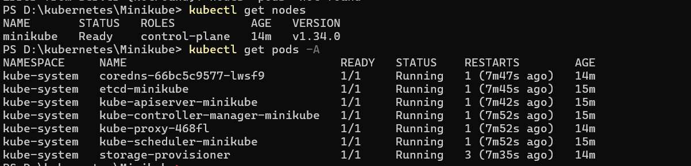

# Завдання 4. Розгортання Namespace, ConfigMap, Secret, Deployment, Service

